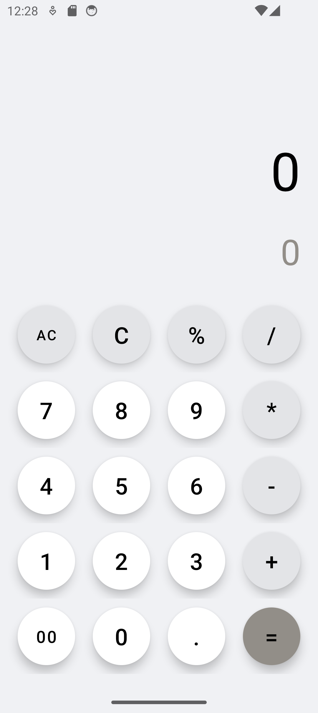
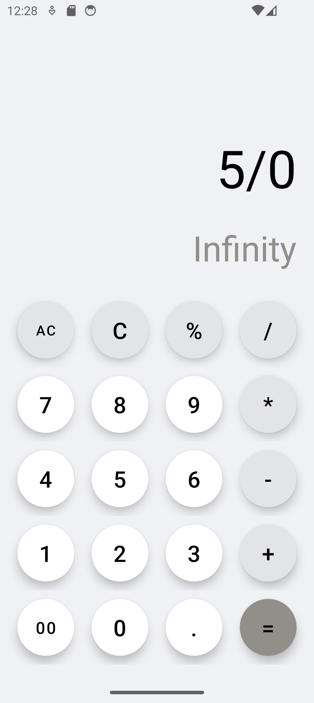
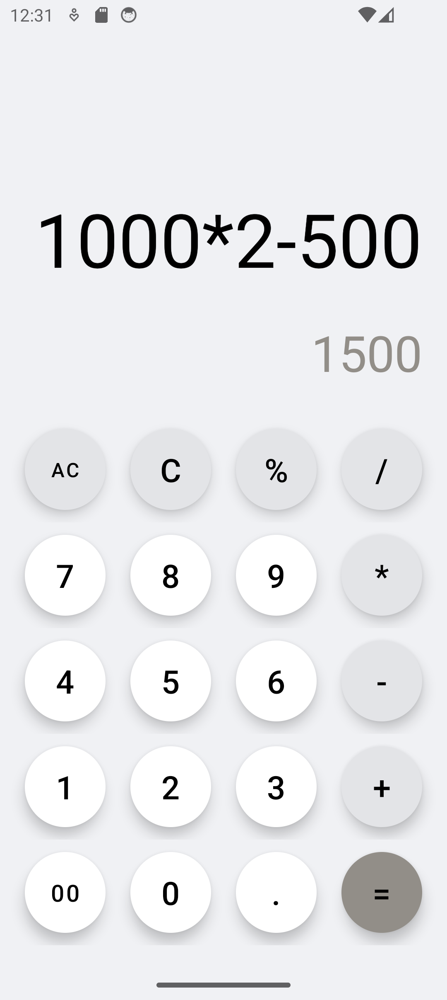
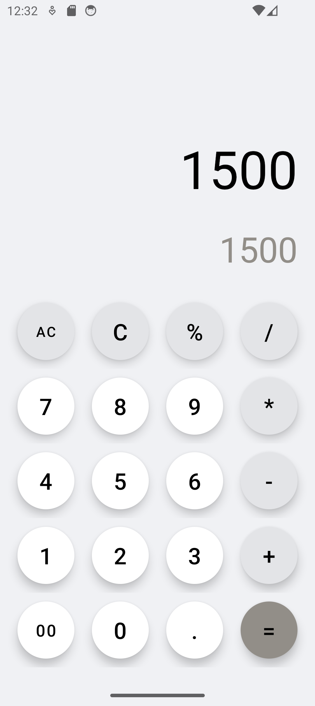
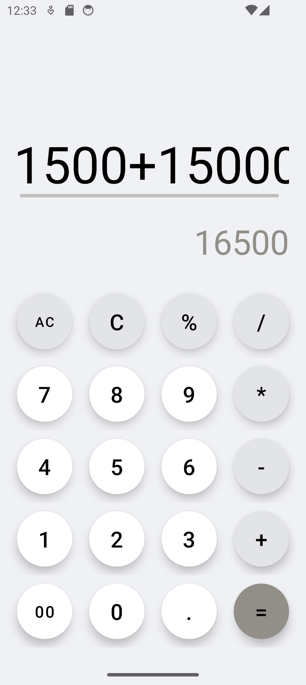
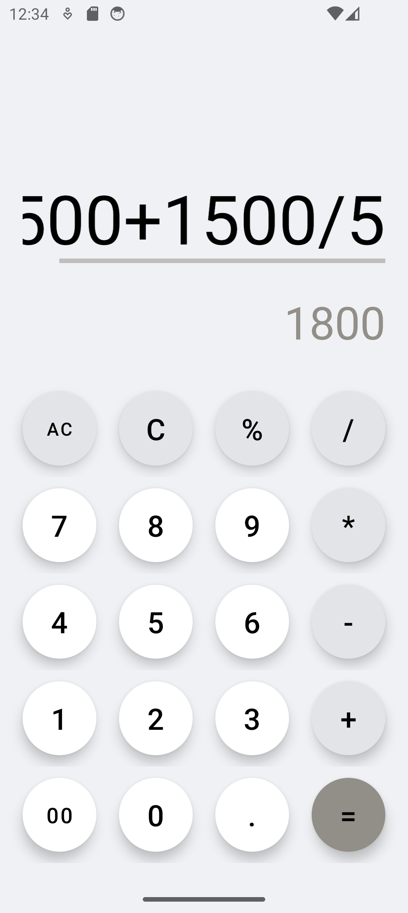
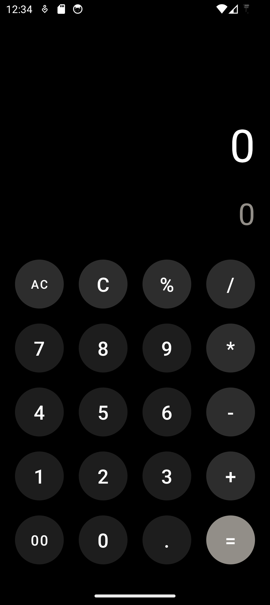
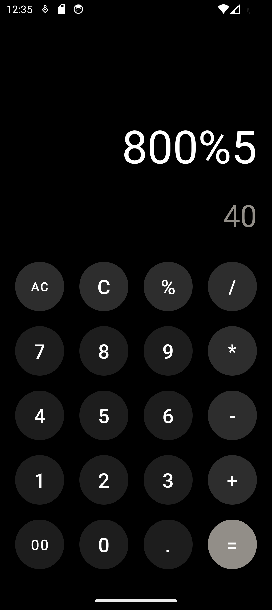

# Calculator Application

A simple arithmetic calculator Android application, provides basic arithmetic operations like addition, subtraction, multiplication, division and modulus, with a clean and intuitive user interface.

## Features

- **Basic Arithmetic Operations:** Perform addition, subtraction, multiplication, division and modulus.
- **Advanced Calculations with Rhino:** Utilizes the [Rhino JavaScript engine](https://github.com/APISENSE/rhino-android) to handle complex expressions and ensure precise calculations.
- **Real-time Results:**  Instantly displays the result as you input values.
- **AC Button:** Reset the entire input and result with a single tap using the **AC** (All Clear) button.
- **Clear Entry:** Clear current input with a dedicated button.
- **Multiple Operations:** Chain calculations by entering multiple operators and numbers.
- **Error Handling:** Handles divide-by-zero and other common errors.
- **Responsive UI:** User-friendly interface with easy-to-read Material Buttons that adjust for different screen sizes.
- **Theme Management:** Supports both light and dark themes for enhanced user experience.
- **Responsive Layout:** Optimized for different screen sizes.

## Technologies Used

- **Android SDK**
- **Java**
- **Material Design Components** for modern UI elements.
- **Rhino JavaScript Engine** for handling complex expressions.
- **XML for UI Design**
- **Gradle for Build Management**

## Future Enhancements

- **Handle Complex Calculations:** Improve the app to manage more advanced mathematical operations and functions.
- **Incorporate Calculation History:** Add a feature to keep track of previous calculations for user convenience.
- **Additional Features:** Explore more functionalities to enhance user experience and utility.

## Screenshots
  
   
   
 

